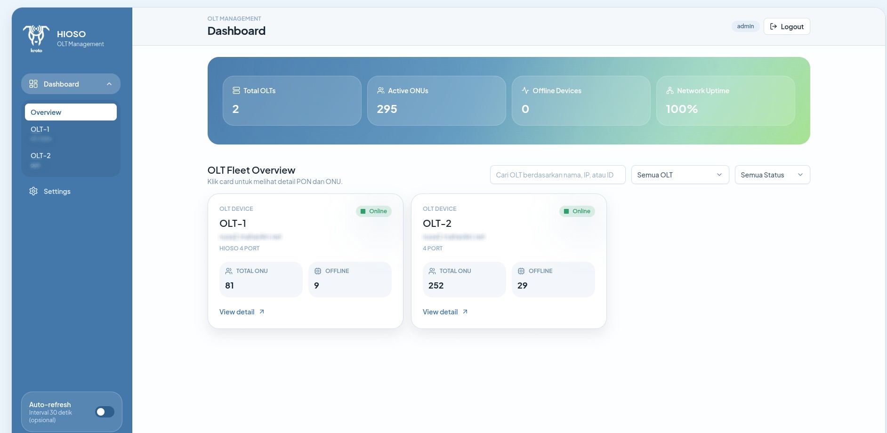
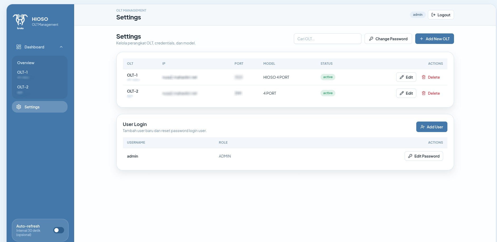

# HIOSOO-DASBOR

HIOSO OLT management REST API with support for multiple devices.

## Dashboard Preview




## Features

- 🚀 High-performance Go backend with Gin framework
- 📊 Multi-device support 
- 🔄 Concurrent scraping with worker pools
- 💾 SQLite database (zero-config, single file)
- 📦 Single binary deployment
- 🔒 Basic authentication for OLT access
- 🔐 JWT-based dashboard user authentication
- 📝 Response caching with configurable TTL

## Methode kerjanya :

This API operates using a simple three-step process:

1.  **Scraping**: Automatically fetches live data directly from the HIOSO OLT web interface.
2.  **Parsing**: Converts the raw data (HTML/JS) from the OLT into a clean, structured **JSON** format.
3.  **API Wrapper**: Wraps OLT functions (Reboot, Update Name, etc.) into a standard **REST API** for easy integration with other applications.


## Install & Usage (Linux)

### 1) Clone Repository

```bash
git clone https://github.com/kroto69/HIOSOO-DASBOR.git
cd HIOSOO-DASBOR
```

### 2) Pilih Mode Menjalankan

#### Mode A: Backend Saja

Requirements:
- Go (untuk build / run dari source)

Jalankan cepat:
```bash
chmod +x scripts/install.sh
./scripts/install.sh
./olt-api
```

Alternatif development mode:
```bash
go run ./cmd/server/main.go
```

Akses:
- API backend: `http://localhost:3000`

#### Mode B: All-in-One (Backend + Frontend Dashboard)

Requirements:
- Go
- Node.js + npm

Jalankan:
```bash
chmod +x run.sh
./run.sh
```

`run.sh` akan:
- build backend bila binary belum ada / source berubah
- install dependency frontend bila belum ada
- menjalankan backend + frontend sekaligus

Akses:
- API backend: `http://localhost:3000`
- Dashboard frontend: `http://localhost:5173`

Stop service:
- tekan `Ctrl+C`

### 3) Login Dashboard

Default awal (sesuai config saat ini):
- Username: `admin`
- Password: `admin`

Disarankan langsung ganti password setelah login pertama.

### Optional: Makefile

```bash
make install
make run
make dev
```

Note: workflow `Makefile` difokuskan untuk Linux.

## API Documentation


Full API documentation is available in [API.md](API.md).

## Configuration

Edit `configs/config.yaml` to customize settings:

```yaml
server:
  port: 3000
  host: 0.0.0.0
  read_timeout: 30s
  write_timeout: 30s

database:
  path: ./olt-api.db

cache:
  enabled: true
  ttl: 60s

scraper:
  timeout: 30s
  max_workers: 200
  retry_attempts: 3

logging:
  level: info
  file: ./logs/app.log

auth:
  jwt_secret: ""         # use AUTH_JWT_SECRET in production
  access_token_ttl: 12h
  initial_username: admin
  initial_password: ""   # if empty, random password is generated on first run
```

Notes:
- `POST /api/v1/auth/login` returns bearer token for dashboard/API access.
- If `auth.initial_password` is empty and no user exists yet, backend creates admin user with random password and prints it in server logs.

## API Response Format

All responses follow this format:

```json
{
  "success": true,
  "message": "Optional message",
  "data": {},
  "device_id": "olt-001",
  "timestamp": "2024-01-01T00:00:00Z"
}
```

Error responses:

```json
{
  "success": false,
  "error": "Error message",
  "timestamp": "2024-01-01T00:00:00Z"
}
```


## Project Structure

```
olt-api/
├── cmd/server/main.go          # Application entry point
├── frontend/                   # Vite React TypeScript dashboard
│   └── src/images/             # Dashboard static assets (logo, preview)
├── internal/
│   ├── config/                 # Configuration loading
│   ├── database/               # Database models and setup
│   ├── handlers/               # HTTP handlers
│   ├── middleware/             # Gin middleware
│   ├── parser/                 # HTML/JS array parsing
│   ├── scraper/                # HTTP client and worker pool
│   └── service/                # Business logic
├── pkg/response/               # Response helpers
├── configs/config.yaml         # Configuration file
├── scripts/                    # Installation scripts
├── Makefile                    # Build commands
└── README.md                   # This file
```

## License

MIT


This project was built by **[Kroto69]** with the assistance of AI technology.

---
